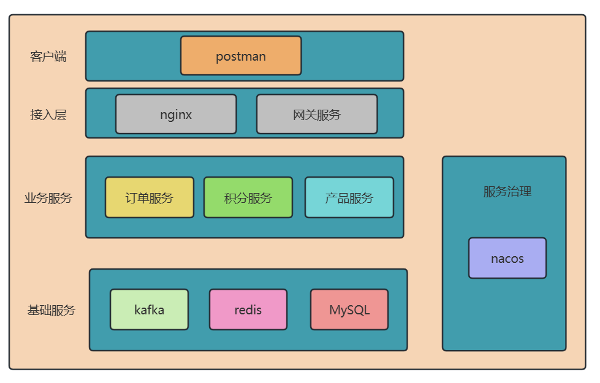
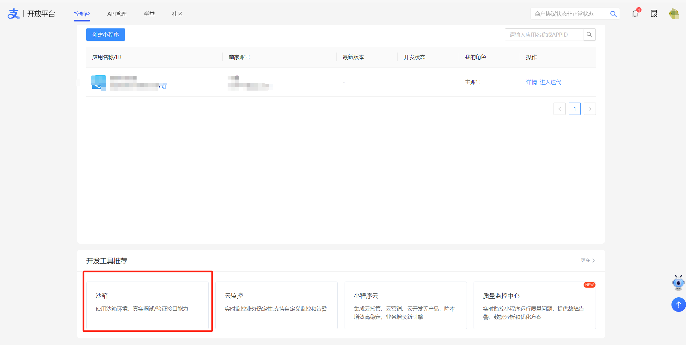
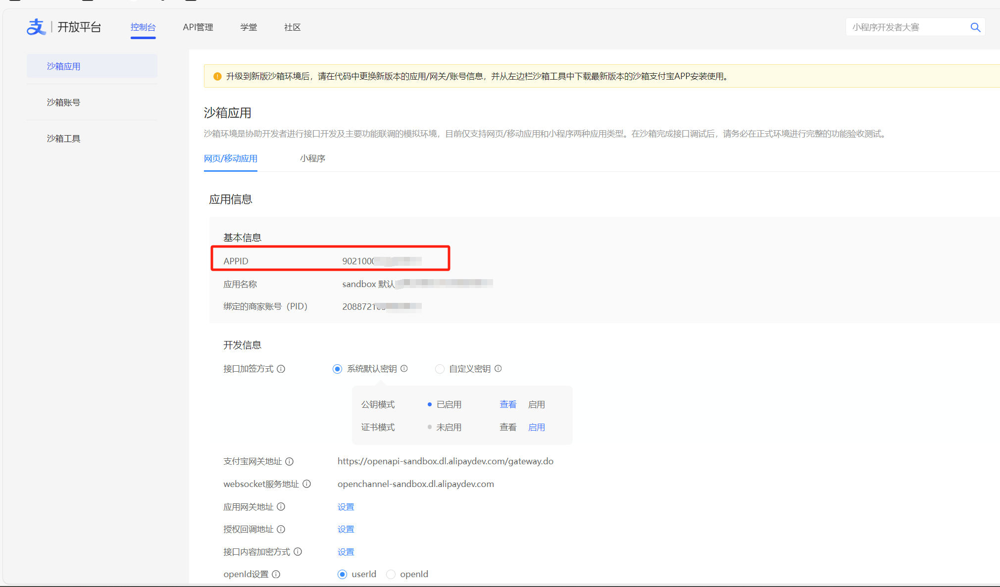
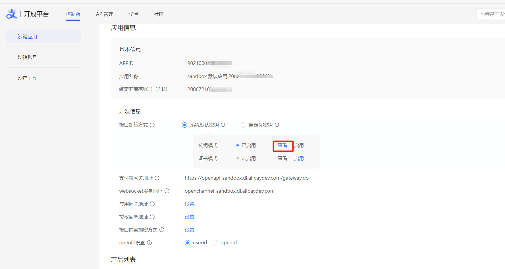
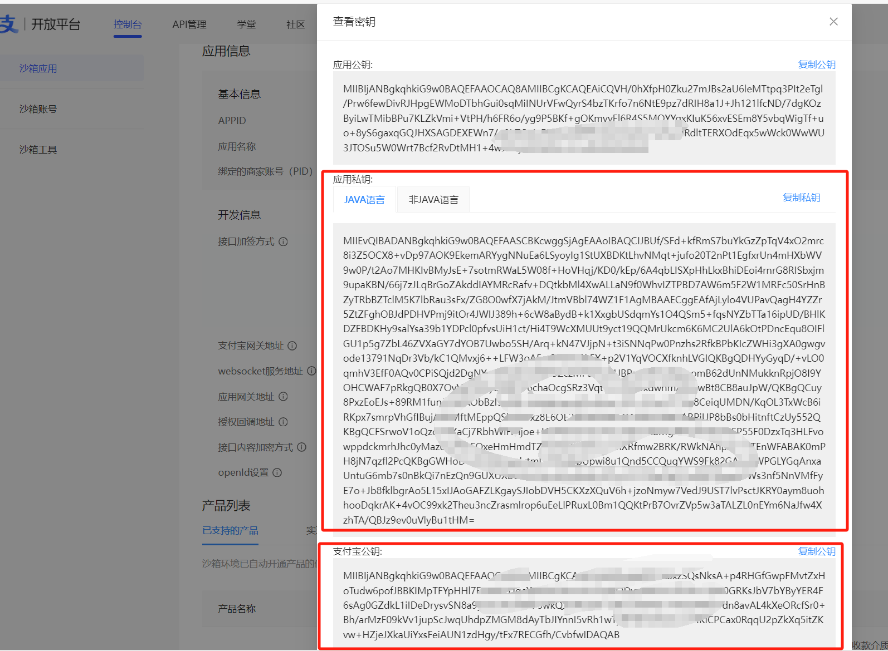
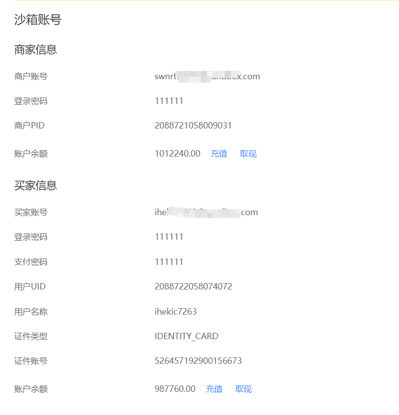
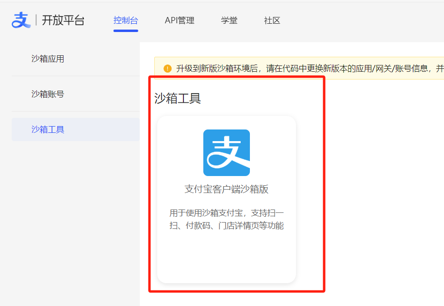

# DemoProject

# **项目说明**

本例子简单的展示SpringBoot+Maven+Mybatis+Dubbo+Kafka+Redis，以及简单的vue3构建的vue项目，vue3+elementUI 搭建的项目仅做简单的前端展示

其中，kafka示例展示了如何向kafka发送单个字符串和自定义对象消息，如何消费字符串和自定义对象。

**可持续补充**：MongoDB、ES、RabbitMQ、RocketMQ等中间件的使用，以及加入nginx或者网关服务，持续接入支付宝其他支付方式以及微信支付

**运维知识**：Docker、K8S、Jenkins、Nexus、Habor、GitLab

**项目架构总览**



# **运行环境**

后端：zookeeper、kafka、jdk8、nacos-server 2.5、MongoDB-8.0.4

前端：Node.js V22.14.0、vue/cli 5.0.8

# **参考资料**

spring+dubbo搭建：https://juejin.cn/post/7159776981771354119

kafka环境搭建，需要分别安装zookeeper和kafka。

本例采用docker安装kafka环境，参考：https://blog.csdn.net/m0_64210833/article/details/134199061

dubbo架构：https://developer.aliyun.com/article/808571

kafka架构：https://blog.csdn.net/qq_32828253/article/details/110732652

支付宝扫码支付文档：[订单码支付 | 支付宝开放平台](https://open.alipay.com/api/detail?code=I1080300001000068149&index=1)

支付宝电脑网站支付文档：[电脑网站支付 | 支付宝开放平台](https://open.alipay.com/api/detail?code=I1080300001000041203&index=1)

# **项目启动**

自行安装kafka环境、redis、nacos，配置数据库好后，启动项目即可，或者参考如下安装即可，以下都是按照学习的东西，按需安装即可，不是都必须安装的

## 1、安装Nacos

启动nacos，下载安装包后。命令窗口进入解压后的bin目录，输入命令，启动nacos

```
startup.cmd -m standalone
```

## **2、Docker安装kafka**

### 2.1、Docker安装Zookeeper

1、拉取镜像

```
docker pull wurstmeister/zookeeper
```

2、启动zookeeper

```
docker run -d --name zookeeper -p 2181:2181 wurstmeister/zookeeper
```

3、进入zookeeper容器（本次示例可不用进入，到第2步即可）

```
docker exec -it zookeeper /bin/bash
```

### 2.2、**Docker安装Kafka**

1、拉取镜像

```
docker pull wurstmeister/kafka
```

2、启动容器

```
docker run -d --name kafka -p 9092:9092 --link zookeeper:zookeeper --env KAFKA_ZOOKEEPER_CONNECT=zookeeper:2181 --env KAFKA_ADVERTISED_LISTENERS=PLAINTEXT://localhost:9092 --env KAFKA_LISTENERS=PLAINTEXT://0.0.0.0:9092 --env KAFKA_OFFSETS_TOPIC_REPLICATION_FACTOR=1 wurstmeister/kafka
```

命令说明

这里，我们链接了ZooKeeper容器，并且设置了几个环境变量来配置Kafka。

在这个命令中：

**--name** kafka: 设置容器的名字为“kafka”。

**-p** 9092:9092: 将容器的9092端口映射到宿主机的9092端口。

**--link** zookeeper:zookeeper: 连接到名为“zookeeper”的另一个Docker容器，并且在当前的容器中可以通过zookeeper这个别名来访问它。

**--env** KAFKA_ZOOKEEPER_CONNECT=zookeeper:2181: 设置环境变量，指定ZooKeeper的连接字符串。

**--env** KAFKA_ADVERTISED_LISTENERS=PLAINTEXT://localhost:9092: 设置环境变量，指定Kafka的advertised listeners。

**--env** KAFKA_LISTENERS=PLAINTEXT://0.0.0.0:9092: 设置环境变量，指定Kafka的listeners。

**--env** KAFKA_OFFSETS_TOPIC_REPLICATION_FACTOR=1: 设置环境变量，指定offsets topic的副本因子。

wurstmeister/kafka: 使用的Docker镜像名字。

## 3、数据库表

```sql
CREATE TABLE `point`  (
  `id` int(11) UNSIGNED NOT NULL AUTO_INCREMENT COMMENT '自增id',
  `account_id` varchar(32) CHARACTER SET latin1 COLLATE latin1_swedish_ci NOT NULL COMMENT '用户id',
  `point` int(11) NOT NULL COMMENT '积分',
  `create_time` datetime NOT NULL DEFAULT CURRENT_TIMESTAMP COMMENT '创建时间',
  `update_time` datetime NOT NULL DEFAULT CURRENT_TIMESTAMP ON UPDATE CURRENT_TIMESTAMP COMMENT '更新时间',
  PRIMARY KEY (`id`) USING BTREE
) ENGINE = InnoDB;
```

## 4、支付宝接入

### 4.1 支付宝开放平台

进入支付宝开放平台，进入沙箱



依次了解相关页面以及我们需要关注的信息（红框所示）



应用私钥和支付宝公钥参考下面方式找到：沙箱应用-》开发信息-》接口加签方式-》系统默认秘钥-》公钥模式-》查看





沙箱账号



沙箱工具



### 4.2 项目配置

application.yml文件配置项：

**alipay.easy.appId**：将“沙箱应用”——》“基本信息”的 APPID 的值替换 app_id

**alipay.easy.merchantPrivateKey**：配置成“应用私钥”，替换application.yml文件中的 application_private_key

**alipay.easy.alipayPublicKey**：配置成“支付宝公钥”，替换application.yml文件中的 alipay_public_key

其中，私钥和公钥，分别参考5.1

**alipay.easy.notifyUrl**：利用内网穿透工具，生成本机 “ip + 端口” 的url，替换application.yml的 url_by_nat_traversal_tool

### 4.3 支付环境搭建

进入“沙箱工具”，**手机下载该沙箱工具**，参考“沙箱账号”的买家信息，登录即可，功能与支付宝功能无异


## 5、demo-vue启动

前端项目demo-vue采用vue/cli方式创建，demo-vue启动流程：

```shell
# 进入到 demo-vue 目录
cd demo-vue
# 运行项目
npm run serve
```

